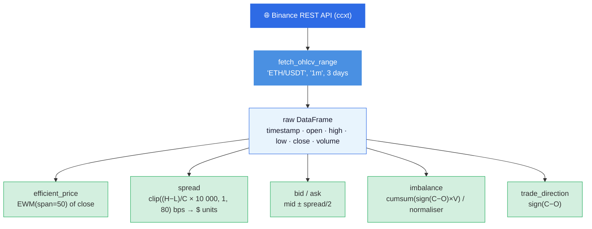

# Kalman Filter Market Making

*Module:* `optimizr._core.LinearKalmanFilter` | *Notebook:* `examples/notebooks/kalman_filter_market_making.ipynb`  
*Added in:* v1.2.0

---

## Overview

This notebook applies **Linear Kalman Filtering** to HFT market making on real Binance
ETH/USDT 1-minute bars. The central insight is that the observable mid-price is a **noisy
measurement** of a latent *efficient price* — the Kalman filter recovers that latent state
in real time and uses it to place better quotes.

Three coupled problems are solved jointly:

| Problem | Classical approach | Kalman approach |
|---|---|---|
| Efficient price recovery | EMA / Hodrick-Prescott | Optimal MMSE linear estimator |
| Volatility estimation | Rolling std | Latent state continuously updated |
| Order-flow imbalance | Cumulative sum | Mean-reverting hidden state |

The resulting quotes are *adaptive*: spreads widen when the filter is uncertain, and quotes
skew based on filtered inventory pressure — reproducing the key qualitative behaviour of the
Avellaneda-Stoikov model from first principles.

---

## Mathematical Background

### 1. Linear State Space Model

The market is described by a **state-space model** with latent state
$\mathbf{x}_t \in \mathbb{R}^3$ and observation $\mathbf{z}_t \in \mathbb{R}^3$:

**State vector**

$$
\mathbf{x}_t =
\begin{pmatrix} p_t \\ v_t \\ \delta_t \end{pmatrix}
$$

where $p_t$ is the *efficient price*, $v_t$ the *volatility state*, and $\delta_t$ the
*order-flow imbalance*.

**Transition equation**

$$
\mathbf{x}_t = F\, \mathbf{x}_{t-1} + \mathbf{w}_t, \qquad
\mathbf{w}_t \sim \mathcal{N}(\mathbf{0},\, Q)
$$

**Observation equation**

$$
\mathbf{z}_t = H\, \mathbf{x}_t + \mathbf{v}_t, \qquad
\mathbf{v}_t \sim \mathcal{N}(\mathbf{0},\, R)
$$

where $\mathbf{z}_t = [\text{mid price},\ \text{spread},\ \text{volume imbalance}]^T$.

---

### 2. The Kalman Filter Recursion

The Kalman filter computes the **minimum mean-squared error (MMSE)** estimate
$\hat{\mathbf{x}}_{t|t} = \mathbb{E}[\mathbf{x}_t \mid \mathbf{z}_{1:t}]$ recursively.

#### Predict step (time update)

$$
\hat{\mathbf{x}}_{t|t-1} = F\, \hat{\mathbf{x}}_{t-1|t-1}
$$

$$
P_{t|t-1} = F P_{t-1|t-1} F^T + Q
$$

$P_{t|t-1}$ is the *predicted error covariance* — a measure of how uncertain the prior
state estimate is.

#### Update step (measurement update)

**Innovation** (residual between the new observation and its prediction):

$$
\tilde{\mathbf{y}}_t = \mathbf{z}_t - H\, \hat{\mathbf{x}}_{t|t-1}
$$

**Innovation covariance**:

$$
S_t = H P_{t|t-1} H^T + R
$$

**Kalman gain** (optimal weighting between prediction and measurement):

$$
K_t = P_{t|t-1}\, H^T\, S_t^{-1}
$$

**Posterior state estimate**:

$$
\hat{\mathbf{x}}_{t|t} = \hat{\mathbf{x}}_{t|t-1} + K_t \tilde{\mathbf{y}}_t
$$

**Joseph-form posterior covariance** (numerically stable):

$$
P_{t|t} = (I - K_t H)\, P_{t|t-1}\, (I - K_t H)^T + K_t R K_t^T
$$

The Kalman gain achieves the trade-off: when $R \to 0$ (noiseless observations) the gain
approaches $H^{-1}$ and we trust observations fully; when $Q \to 0$ (perfect dynamics)
the gain approaches $0$ and we ignore new data.

---

### 3. Transition and Observation Matrices Used in the Notebook

**Transition matrix** $F$:

$$
F =
\begin{pmatrix}
1.00 & 0.00 & 0.01 \\
0.00 & 0.95 & 0.00 \\
0.00 & 0.00 & 0.90
\end{pmatrix}
$$

Interpretation:
- Efficient price is a random walk driven by a small imbalance inflow ($F_{13} = 0.01$).
- Volatility mean-reverts with decay $\rho_v = 0.95$ per bar.
- Imbalance mean-reverts with decay $\rho_\delta = 0.90$ per bar.

**Observation matrix** $H$:

$$
H =
\begin{pmatrix}
1.0 & 0.0 & 0.0 \\
0.0 & 2.0 & 0.0 \\
0.0 & 0.0 & 1.0
\end{pmatrix}
$$

The bid-ask spread is modelled as proportional to volatility with coefficient 2 (Kyle 1985):
$\text{spread} \approx 2 v_t$.

**Process noise** $Q = \text{diag}(10^{-3},\ 10^{-4},\ 5 \times 10^{-3})$: imbalance is
noisiest (order routing randomness), volatility is slowest-moving.

**Observation noise** $R = \text{diag}(0.05,\ 0.01,\ 0.02)$: mid-price carries the
largest microstructure noise (bid-ask bounce, rounding).

---

### 4. Microstructure Model and Efficient Price

The observable mid-price decomposes as:

$$
z^{\text{mid}}_t = p_t + \xi_t, \qquad \xi_t \sim \mathcal{N}(0, R_{11})
$$

where $\xi_t$ encodes *microstructure noise*: bid-ask bounce, quote flickering, and
adverse selection. The efficient price $p_t$ follows a near-random walk:

$$
p_t = p_{t-1} + 0.01\, \delta_{t-1} + w^p_t
$$

The prior (initialisation) for $p_0$ is the raw close at time 0; the EWM (span = 50)
provides an alternative reference that is compared with the Kalman estimate in the
visualisation.

**Observation of spread** (state 2):

$$
z^{\text{spread}}_t = 2 v_t + \xi^s_t
$$

This implements the *Roll (1984)* insight that the quoted spread is proportional to the
underlying price uncertainty.

**Intra-bar spread proxy** used in the data:

$$
\text{spread\_bps}_t = \text{clip}\!\left(\frac{H_t - L_t}{C_t} \times 10^4,\ 1,\ 80\right)
$$

---

### 5. Log-Likelihood

The Kalman filter also computes the **Gaussian log-likelihood** of the observation
sequence, used for parameter estimation (EM algorithm, MLE):

$$
\ell = -\frac{1}{2} \sum_{t=1}^{T}
\Bigl( \log|S_t| + \tilde{\mathbf{y}}_t^T S_t^{-1} \tilde{\mathbf{y}}_t + d\log(2\pi) \Bigr)
$$

where $d = 3$ is the observation dimension. The `optimizr` backend returns this via
`result.get_log_likelihood()`.

---

### 6. Adaptive Market Making: From Filter to Quotes

The **Avellaneda-Stoikov (2008)** market making framework gives the optimal reservation
price and spread for a risk-averse market maker. The Kalman-enhanced version replaces the
naive mid-price with the filtered efficient price and uses the posterior variance as the
uncertainty measure.

#### Reservation price (inventory-adjusted mid)

$$
r_t = \hat{p}_t - q_t\, \gamma\, \sigma^2_t\, T
$$

where $q_t$ is the current inventory, $\gamma$ the risk-aversion coefficient, $\sigma^2_t$
the variance estimate, and $T$ the time horizon. Implemented via the *inventory skew*:

$$
\text{skew}_t = \gamma \cdot \frac{q_t}{q_{\max}}
$$

#### Optimal spread

The Avellaneda-Stoikov optimal spread is:

$$
\delta^* = \gamma \sigma^2_t T + \frac{2}{\gamma} \ln\!\left(1 + \frac{\gamma}{\kappa}\right)
$$

where $\kappa$ is the order-arrival intensity. In the notebook this is approximated by an
*adaptive spread* that scales with the filtered volatility and Kalman uncertainty:

$$
\delta_t = \delta_0 \cdot (1 + 2\, v_t) \cdot (1 + \sigma^P_t)
$$

where $\delta_0$ is the base spread, $v_t = \hat{x}^{(2)}_t$ the filtered volatility, and
$\sigma^P_t = \sqrt{P_{t|t}^{(1,1)}}$ the posterior standard deviation of the price state.

The quotes are then:

$$
b_t = r_t - \frac{\delta_t}{2}, \qquad a_t = r_t + \frac{\delta_t}{2}
$$

---

### 7. Order-Flow Imbalance State

The third latent state $\delta_t$ captures directional order flow. It is initialised from
the cumulative signed-volume proxy:

$$
\delta_0 = \frac{\sum_{k=1}^{t} \text{sgn}(C_k - O_k)\, V_k}
            {\max\!\left(\max_t|\text{cumvol}|,\ \varepsilon\right)}
$$

and subsequently filtered by the Kalman recursion. Its transition $F_{33} = 0.90$
implements a first-order autoregressive mean-reverting process:

$$
\delta_t = 0.90\, \delta_{t-1} + w^\delta_t,\quad w^\delta_t \sim \mathcal{N}(0, 5\times 10^{-3})
$$

This matches empirically observed short-horizon predictability of order flow (Cont, Kukanov
& Stoikov 2014).

---

### 8. Bayesian Interpretation

The Kalman filter is the exact **Bayesian posterior** under Gaussian linear assumptions:

$$
p(\mathbf{x}_t \mid \mathbf{z}_{1:t})
= \mathcal{N}\!\bigl(\hat{\mathbf{x}}_{t|t},\ P_{t|t}\bigr)
$$

The *predict* step computes the prior:

$$
p(\mathbf{x}_t \mid \mathbf{z}_{1:t-1}) = \mathcal{N}(\hat{\mathbf{x}}_{t|t-1},\ P_{t|t-1})
$$

and the *update* step applies Bayes' theorem with the Gaussian likelihood
$p(\mathbf{z}_t \mid \mathbf{x}_t) = \mathcal{N}(H\mathbf{x}_t, R)$ to yield the posterior.
Under non-Gaussian noise, the Extended Kalman Filter (EKF) or Unscented Kalman Filter (UKF)
would be required; for ETH/USDT 1-minute bars the Gaussian approximation is adequate.

---

### 9. RTS Smoother (Rauch-Tung-Striebel)

The `RTSSmoother` imported in Cell 1 (but not exercised in this notebook) performs
**backward smoothing** over the full batch:

$$
\hat{\mathbf{x}}_{t|T} = \hat{\mathbf{x}}_{t|t} + G_t\bigl(
\hat{\mathbf{x}}_{t+1|T} - \hat{\mathbf{x}}_{t+1|t}
\bigr)
$$

$$
G_t = P_{t|t} F^T P_{t+1|t}^{-1}
$$

The smoother minimises $\mathbb{E}[\|\mathbf{x}_t - \hat{\mathbf{x}}_{t|T}\|^2]$ over all
time $T$, giving lower RMSE than the one-sided filter — useful for offline parameter
estimation and backtesting, but not for live trading.

---

## Data Pipeline



Observations fed to the Kalman filter: `[mid_price, spread, imbalance]` — one row per bar.

---

## API Reference

### `optimizr._core.LinearKalmanFilter`

```python
from optimizr._core import LinearKalmanFilter

kf = LinearKalmanFilter(
    F: list[list[float]],   # n×n state transition
    H: list[list[float]],   # m×n observation
    Q: list[list[float]],   # n×n process noise
    R: list[list[float]],   # m×m observation noise
    x0: list[float],        # n initial state
    P0: list[list[float]],  # n×n initial covariance
)

result = kf.filter(observations: list[list[float]])

states       = np.array(result.get_states()).reshape(-1, n)       # (T, n)
covariances  = np.array(result.get_covariances()).reshape(-1, n, n) # (T, n, n)
log_lik      = result.get_log_likelihood()                         # float
```

### `KalmanEnhancedMarketMaker` (Python)

```python
mm = KalmanEnhancedMarketMaker(
    base_spread=1.50,    # $ — tuned for ETH price level (~$3 000)
    risk_aversion=0.60,  # γ inventory-skew coefficient
    max_inventory=10,    # maximum net position in ETH units
)

# Per-tick update
result = mm.update(tick_row, filtered_price, filtered_vol, price_uncertainty)
# result: {'bid', 'ask', 'spread', 'inventory', 'pnl'}
```

---

## Performance Metrics Reported

| Metric | Formula |
|---|---|
| Price RMSE (Kalman) | $\sqrt{\frac{1}{T}\sum (p^\text{filtered}_t - p^\text{EWM}_t)^2}$ |
| Price RMSE (raw) | $\sqrt{\frac{1}{T}\sum (z^\text{mid}_t - p^\text{EWM}_t)^2}$ |
| Annualised Sharpe | $\frac{\bar{\Delta \text{PnL}}}{\sigma_{\Delta\text{PnL}}} \sqrt{252 \times 6.5 \times 3600}$ |
| Log-likelihood | $\ell = -\tfrac{1}{2}\sum_t(\log|S_t| + \tilde{y}_t^T S_t^{-1}\tilde{y}_t + d\log 2\pi)$ |

---

## References

| Paper | Relevance |
|---|---|
| Kalman (1960). *A New Approach to Linear Filtering and Prediction Problems.* J. Basic Engineering. | Original KF derivation |
| Rauch, Tung & Striebel (1965). *Maximum likelihood estimates of linear dynamic systems.* AIAA Journal. | RTS smoother |
| Roll (1984). *A Simple Implicit Measure of the Effective Bid-Ask Spread.* Journal of Finance. | Spread ∝ volatility |
| Kyle (1985). *Continuous Auctions and Insider Trading.* Econometrica. | Observation matrix $H_{22}=2$ |
| Avellaneda & Stoikov (2008). *High-frequency trading in a limit order book.* Quantitative Finance. | Optimal spread formula |
| Cont, Kukanov & Stoikov (2014). *The Price Impact of Order Book Events.* J. Financial Econometrics. | Order-flow mean reversion |
| Ho & Stoll (1981). *Optimal Dealer Pricing Under Transactions and Return Uncertainty.* J. Financial Economics. | Inventory management |
